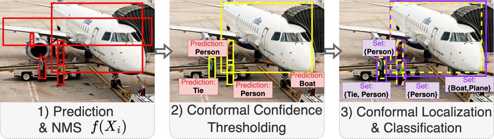
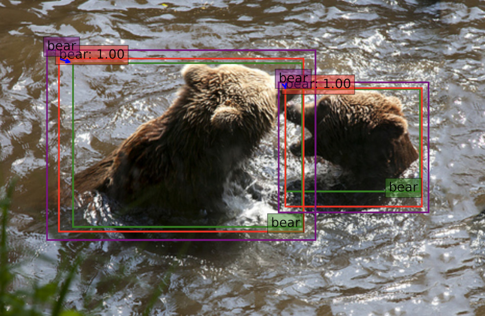

# 🐟 CODS - Conformal Object Detection and Segmentation 🐟

[](https://pypi.org/project/cods/)
[](https://github.com/leoandeol/cods/actions/workflows/ci.yml)
[](https://opensource.org/licenses/MIT)
[](https://www.python.org/)
[](https://pypi.org/project/cods/)

*A library for distribution-free model-agnostic finite-sample uncertainty quantification applied to computer vision tasks!*



A library for Conformal Classification, Object Detection and Segmentation, based on PyTorch, with all the latest methods and models!

## Introduction

### What is Conformal Prediction?

Conformal prediction is a framework in machine learning that provides a way to quantify the uncertainty of predictions. 
It goes beyond traditional point predictions by providing a set of possible outcomes along with confidence levels. 
This allows for more reliable and interpretable predictions, especially in situations where the training data is limited or noisy. 
Conformal prediction can be applied to various tasks, including classification, regression, object detection, and segmentation.

### What is CODS and why? 

CODS is a vision-oriented python library that implements conformal prediction for classification, object detection and (soon) segmentation.
It is built on top of PyTorch for efficiency (with CUDA support), and is designed to allow for easy addition of new conformal scores, procedures, models or dataset, and for quick benchmarking of those.  

## 🚀 Quick Start

### Installation

#### Using Pip

```bash
pip install cods
```

#### Installing from Source

```bash
git clone https://github.com/leoandeol/cods.git
cd cods
pip install -r requirements.txt
pip install -e .
```

### Example

Application of CODS to the image of a kitchen in MS-COCO with α=0.1



## Tutorials

### Classification

[Introduction to Conformal Classification](./notebooks/(CLASSIF)%201%20-%20Introduction%20to%20Conformal%20Classification.ipynb)

### Object Detection

[Introduction to Conformal Object Detection](./notebooks/(OD)%201%20-%20Introduction%20to%20Conformal%20Object%20Detection.ipynb)

### Segmentation

[Work in Progress]

## 📦 What's Included

1. Classification: [Implemented]
2. Regression: [Not Implemented]
3. Object Detection: [Implemented]
4. Segmentation: [Work in Progress]

## Creators

This project was developped by Léo Andéol & Luca Mossina as part of the DEEL project.

## References

1. [Vovk et al. 2005: Algorithmic Learning in a Random World](https://link.springer.com/book/10.1007/978-3-031-06649-8)
2. [Angelopoulos et al. 2021: Conformal Prediction: A Gentle Introduction](https://www.nowpublishers.com/article/Details/MAL-101)
3. [Shafer et al. 2008: A Tutorial on Conformal Prediction](https://www.jmlr.org/papers/v9/shafer08a.html)
4. [Angelopoulos et al. 2022: Conformal Risk Control](https://arxiv.org/abs/2208.02814)
5. [Park et al. 2020: PAC Confidence Sets for Deep Neural Networks via Calibrated Prediction](https://arxiv.org/abs/2001.00106)
6. [Bates et al 2019: Risk Controlling Prediction Sets](https://dl.acm.org/doi/abs/10.1145/3478535)
7. [Andéol et al. 2023: Confident Object Detection via Conformal Prediction and Conformal Risk Control](https://proceedings.mlr.press/v204/andeol23a.html)
8. [Li et al. 2022: Towards PAC Multi-Object Detection and Tracking](https://arxiv.org/abs/2204.07482)

## Citation

If you use CODS in your research, please cite the following reference:

```bibtex
@misc{andeol2024cods, 
    title={Conformal Object Detection \& Segmentation},
    author={Andéol, Léo and Mossina, Luca},
    year={2024},
    howpublished={https://github.com/leoandeol/cods},
}
```

## License

The package is released under the [MIT License](https://choosealicense.com/licenses/mit).
